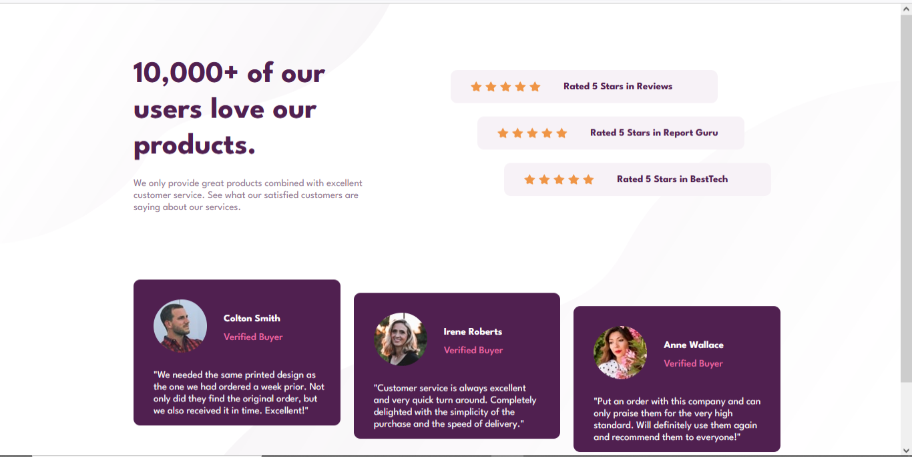

# Frontend Mentor - Social proof section solution

This is a solution to the [Social proof section challenge on Frontend Mentor](https://www.frontendmentor.io/challenges/social-proof-section-6e0qTv_bA). Frontend Mentor challenges help you improve your coding skills by building realistic projects. 

## Table of contents

- [Frontend Mentor - Social proof section solution](#frontend-mentor---social-proof-section-solution)
  - [Table of contents](#table-of-contents)
  - [Overview](#overview)
    - [The challenge](#the-challenge)
    - [Screenshot](#screenshot)
    - [Links](#links)
  - [My process](#my-process)
    - [Built with](#built-with)
    - [What I learned](#what-i-learned)
    - [Continued development](#continued-development)
  - [Author](#author)
  - [Acknowledgments](#acknowledgments)

**Note: Delete this note and update the table of contents based on what sections you keep.**

## Overview

### The challenge

Users should be able to:

- View the optimal layout for the section depending on their device's screen size

### Screenshot

### Links

- Solution URL: [Add solution URL here](https://your-solution-url.com)
- Live Site URL: [Add live site URL here](https://your-live-site-url.com)

## My process

### Built with

- Semantic HTML5 markup
- CSS custom properties
- Flexbox
- CSS Grid
- Mobile-first workflow
- [Styled Components](https://styled-components.com/) - For styles

**Note: These are just examples. Delete this note and replace the list above with your own choices**

### What I learned

This website was built using CSS Grids and flexbox, I was able to learn how to align elements properly
and use various elements selectors and semantics.

To see how you can add code snippets, see below:

### Continued development

I will continue to focus on brushing my CSS skills, especially CSS grids and Flexbox which have been
very important in building this site.

## Author

- Website - [Add your name here](https://www.your-site.com)
- Frontend Mentor - [@joshua094](https://www.frontendmentor.io/profile/joshua094)
- Twitter - [@emm_olj](https://www.twitter.com/emm_olj)

## Acknowledgments

Special thanks to my friend, Moyosore who told me about frontend mentor and gave me the link to complete this project.
